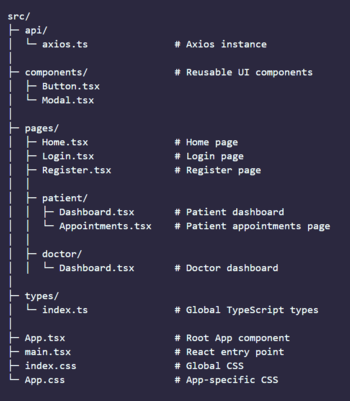

# Doctor Appointment Management System

A modern web application for managing doctor appointments. Patients can search for doctors, filter by specialization and book appointments. Doctors can view their dashboard and manage their appointments. Built with **React (Vite)**, **TypeScript**, **React Query**, **Axios** and **Tailwind CSS**.

---

## Table of Contents

- [Live Demo](#live-demo)
- [Features](#features)
- [Tech Stack](#tech-stack)
- [Installation](#installation)
- [Folder Structure](#folder-structure)
- [Usage](#usage)
- [Limitations](#limitations)

---

## Live Demo

> [https://doctor-appointment-management-system.vercel.app/](https://doctor-appointment-management-system.vercel.app/)

---

## Features

### Patient

- Login as a patient
- Search for doctors by name
- Filter doctors by specialization
- View doctor details
- Book appointments (currently not functional due to backend restriction)

### Doctor

- Login as a doctor
- View appointments and schedule (currently no appointments appear due to booking issue)

### Responsiveness & UI/UX

- Responsive UI with Tailwind CSS
- Basic UX Principles

---

## Tech Stack

- **Frontend:** React 19 (Vite), TypeScript, Tailwind CSS
- **State Management:** React Query
- **HTTP Client:** Axios
- **Routing:** React Router
- **Authentication:** JWT (stored in localStorage)

---

## Installation

1. Clone the repository, install and run:

```bash
git clone https://github.com/faizulislamfair/doctor-appointment-management-system
cd doctor-appointment-management-system
npm install
npm run dev
```

---

## Folder Structure



---

## Usage

### Login / Register

- Choose to login as a **Patient** or **Doctor**.
- Patients can search doctors and attempt to book appointments.
- Doctors can log in to view their dashboards.

### Search and Filter Doctors

- Use the search bar to find doctors by name.
- Use the specialization dropdown to filter by category.

### Book Appointment (Patient)

- Click on **Book Appointment** for any doctor.
- Select a date and confirm.
- _(Currently fails due to backend authentication issue)_

### View Appointments (Doctor)

- Doctors can access their dashboard.
- _(No appointments will appear because booking requests fail)_

---

## Limitations

- **Appointment Booking Fails**  
  Booking ails with `401 Unauthorized`, this happens because the backend requires authentication that cannot be satisfied from the frontend alone.

- **Doctor Dashboard Empty**  
  Since appointments can’t be created, the doctor’s dashboard doesn’t display any patient bookings.

- **No Backend Control**  
  The backend is externally managed, and changes cannot be made to fix the authentication flow.

- **Workaround**  
  The application works fully for login, search, filter, and navigation. Appointment booking and doctor-side scheduling are not functional.
